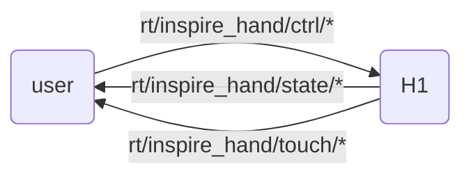

# Dexterous Hand SDK Introduction

The H1 can be equipped with [Inspire Robotics](https://inspire-robots.com/product/frwz/)' humanoid five-finger dexterous hand. This dexterous hand has 6 degrees of freedom and 12 motion joints, and integrates 17 tactile sensors, which can simulate human hands to achieve complex movements.

## Control Methods

Inspire officially provides two communication methods: ModBusRTU via 485 serial port and ModbusTCP. This SDK uses ModbusTCP to communicate with the dexterous hand, forwarding data and control commands in DDS format.

The H1 provides a USB-to-serial module. Users can plug this USB into the H1 development computing unit (PC2, PC3) to control the dexterous hand via 485 communication. In this case, the port is usually /dev/ttyUSB0. In this mode, the old version SDK can be used for communication, but tactile sensor data acquisition is not supported. This version SDK does not support 485 serial communication.

1. Control using Inspire's official SDK

Users can write their own programs to control the dexterous hand according to Inspire's official communication protocol.

2. Control using Unitree's dexterous hand SDK

H1 communication is built on the DDS framework. To facilitate controlling the dexterous hand using unitree_sdk2, Unitree provides sample programs that convert ModbusTCP data to DDS messages (download link at the bottom of the document).

## Unitree SDK Interface Description

Users send `"inspire::inspire_hand_ctrl"` messages to the `"rt/inspire_hand/ctrl/*"` topic to control the dexterous hand.
Receive `"inspire::inspire_hand_state"` messages from the `"rt/inspire_hand/state/*"` topic to get dexterous hand state.
Receive `"inspire::inspire_hand_touch"` messages from the `"rt/inspire_hand/touch/*"` topic to get tactile sensor data.
Where `*` is the topic suffix, default is `r`, indicating right hand.



## IDL Data Format

Motor data in array format is used, containing data for 12 motors of both hands internally. For the specific format of MotorCmd_.idl and MotorState_.idl, see [Basic Services Interface](https://support.unitree.com/home/zh/H1_developer/Basic_Services_Interface)

The dexterous hand data format is basically the same as Inspire's official documentation. For details, check the `.idl` files in `inspire_hand_sdk/hand_idl`.

```cpp
//inspire_hand_ctrl.idl
module inspire
{
    struct inspire_hand_ctrl
    {
        sequence<int16,6>  pos_set;
        sequence<int16,6>  angle_set;
        sequence<int16,6>  force_set;
        sequence<int16,6>  speed_set;
        int8 mode;
    };
};

//inspire_hand_state.idl
module inspire
{
    struct inspire_hand_state
    {
        sequence<int16,6>  pos_act;
        sequence<int16,6>  angle_act;
        sequence<int16,6>  force_act;
        sequence<int16,6>  current;
        sequence<uint8,6>  err;
        sequence<uint8,6>  status;
        sequence<uint8,6>  temperature;
    };
};


//inspire_hand_touch.idl
module inspire
{
    struct inspire_hand_touch
    {
        sequence<int16,9>   fingerone_tip_touch;      // Pinky fingertip tactile data
        sequence<int16,96>  fingerone_top_touch;      // Pinky finger top tactile data
        sequence<int16,80>  fingerone_palm_touch;     // Pinky finger pad tactile data
        sequence<int16,9>   fingertwo_tip_touch;      // Ring fingertip tactile data
        sequence<int16,96>  fingertwo_top_touch;      // Ring finger top tactile data
        sequence<int16,80>  fingertwo_palm_touch;     // Ring finger pad tactile data
        sequence<int16,9>   fingerthree_tip_touch;    // Middle fingertip tactile data
        sequence<int16,96>  fingerthree_top_touch;    // Middle finger top tactile data
        sequence<int16,80>  fingerthree_palm_touch;   // Middle finger pad tactile data
        sequence<int16,9>   fingerfour_tip_touch;     // Index fingertip tactile data
        sequence<int16,96>  fingerfour_top_touch;     // Index finger top tactile data
        sequence<int16,80>  fingerfour_palm_touch;    // Index finger pad tactile data
        sequence<int16,9>   fingerfive_tip_touch;     // Thumb fingertip tactile data
        sequence<int16,96>  fingerfive_top_touch;     // Thumb top tactile data
        sequence<int16,9>   fingerfive_middle_touch;  // Thumb middle tactile data
        sequence<int16,96>  fingerfive_palm_touch;    // Thumb pad tactile data
        sequence<int16,112> palm_touch;                // Palm tactile data
    };

};

```

!!! note
    The control message adds mode options. The combination mode of control commands is implemented in binary form to achieve specified commands.
    mode 0: 0000 (No operation)
    mode 1: 0001 (Angle)
    mode 2: 0010 (Position)
    mode 3: 0011 (Angle + Position)
    mode 4: 0100 (Force control)
    mode 5: 0101 (Angle + Force control)
    mode 6: 0110 (Position + Force control)
    mode 7: 0111 (Angle + Position + Force control)
    mode 8: 1000 (Speed)
    mode 9: 1001 (Angle + Speed)
    mode 10: 1010 (Position + Speed)
    mode 11: 1011 (Angle + Position + Speed)
    mode 12: 1100 (Force control + Speed)
    mode 13: 1101 (Angle + Force control + Speed)
    mode 14: 1110 (Position + Force control + Speed)
    mode 15: 1111 (Angle + Position + Force control + Speed)  
!!!

+ Joint order in IDL

<div style="text-align: center;">
<table border="1">
  <tr>
    <td>Id</td>
    <td>0</td>
    <td>1</td>
    <td>2</td>
    <td>3</td>
    <td>4</td>
    <td>5</td>
  <tr>
    <td rowspan="2">Joint</td>
    <td colspan="6">Hand</td>
  </tr>
  <tr>
    <td>pinky</td>
    <td>ring</td>
    <td>middle</td>
    <td>index</td>
    <td>thumb-bend</td>
    <td>thumb-rotation</td>
  </tr>
</table>
</div>

---

# 
# SDK Installation and Usage
This SDK is mainly implemented in Python, and its operation depends on [`unitree_sdk2_python`](https://github.com/unitreerobotics/unitree_sdk2_python), while using pyqt5 and pyqtgraph for visualization.

First, git clone the SDK working directory:

```bash
git clone https://github.com/NaCl-1374/inspire_hand_ws.git
```

It is recommended to use `venv` for virtual environment management:

```bash
python -m venv venv
source venv/bin/activate  # Linux/MacOS
# or
venv\Scripts\activate  # Windows
```

## Install Dependencies

1. Install project dependencies:

    ```bash
    pip install -r requirements.txt
    ```

2. Update submodules:

    ```bash
    git submodule init  # Initialize submodules
    git submodule update  # Update submodules to latest version
    ```

3. Install both SDKs separately:

    ```bash
    cd unitree_sdk2_python
    pip install -e .

    cd ../inspire_hand_sdk
    pip install -e .
    ```
## Usage

## Dexterous Hand and Environment Configuration

First, configure the network for the device. The dexterous hand default IP is: `192.168.11.210`. The device network segment needs to be in the same network segment as the dexterous hand. After configuration, execute `ping 192.168.11.210` to check if communication is normal.

If you need to adjust the dexterous hand IP and other parameters, you can execute the **Dexterous Hand Configuration Panel** in the usage examples below to start the panel for configuration.
After the panel starts, it will automatically read the device information on the current network. After modifying parameters on the panel, you need to click `Write Settings` to send the parameters to the dexterous hand. At this time, the parameters will not take effect. To make them effective, you need to click `Save Settings` and restart the settings.

!!!note

    If you modify the IP, you need to modify the following code in related files, changing the ip option to the modified IP.

    ``` python
        # inspire_hand_sdk/example/Vision_driver.py and inspire_hand_sdk/example/Headless_driver.py
        handler=inspire_sdk.ModbusDataHandler(ip=inspire_hand_defaut.defaut_ip,LR='r',device_id=1)

        # inspire_hand_sdk/example/init_set_inspire_hand.py
        window = MainWindow(ip=defaut_ip)
    ```
    The `LR` option is the parameter for the DDS message suffix `*`, which can be defined according to the device.
!!!


### 使用示例

以下为几个常用示例的使用说明：

1. **DDS 发布控制指令**：

    运行以下脚本来发布控制指令：
    ```bash
    python inspire_hand_sdk/example/dds_publish.py
    ```

2. **DDS 订阅灵巧手状态和触觉传感器数据，并可视化**：

    运行以下脚本来订阅灵巧手的状态和传感器数据，并进行数据可视化：
    ```bash
    python inspire_hand_sdk/example/dds_subscribe.py
    ```

3. **灵巧手 DDS 驱动（无图模式）**：

    使用以下脚本进行无图模式的驱动操作：
    ```bash
    python inspire_hand_sdk/example/Headless_driver.py
    ```

4. **灵巧手配置面板**：

    运行以下脚本来使用灵巧手的配置面板：
    ```bash
    python inspire_hand_sdk/example/init_set_inspire_hand.py
    ```

5. **灵巧手 DDS 驱动（面板模式）**：

    通过以下脚本进入面板模式，控制灵巧手的 DDS 驱动：
    ```bash
    python inspire_hand_sdk/example/Vision_driver.py
    ```
6. **DDS 发布控制指令 C++**：

    运行以下命令编译运行示例程序：
    ```bash
    cd inspire_hand_sdk
    mkdir build && cd build
    cmake ..
    make 
    ./hand_dds
    ```  
 !!! note

    若使用多个灵巧手，则可以将类似如下代码，复制对应的类，并重设`ip`，`LR`选项:

    ``` python
        # inspire_hand_sdk/example/Vision_driver.py
        import sys
        from inspire_sdkpy import qt_tabs,inspire_sdk,inspire_hand_defaut
        # import inspire_sdkpy
        if __name__ == "__main__":
            app_r = qt_tabs.QApplication(sys.argv)
            handler_r=inspire_sdk.ModbusDataHandler(ip='********',LR='r',device_id=1)
            window_r = qt_tabs.MainWindow(data_handler=handler,dt=20,name="Hand Vision Driver")
            window_r.reflash()
            window_r.show()
            sys.exit(app_r.exec_())
            # copy for left hand
            app_l = qt_tabs.QApplication(sys.argv)
            handler_l=inspire_sdk.ModbusDataHandler(ip='********',LR='l',device_id=1)
            window_l = qt_tabs.MainWindow(data_handler=handler,dt=20,name="Hand Vision Driver")
            window_l.reflash()
            window_l.show()
            sys.exit(app_l.exec_())
    ```
 !!!

---
